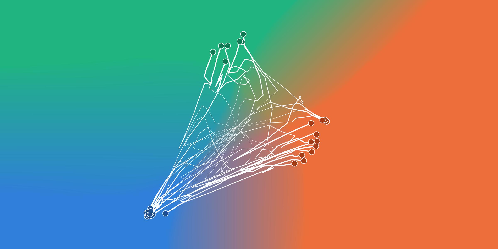
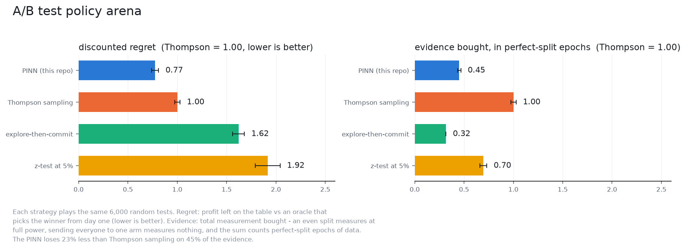
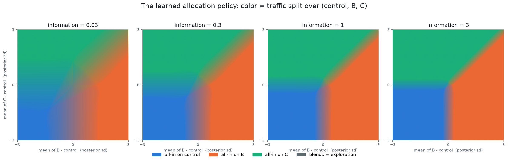
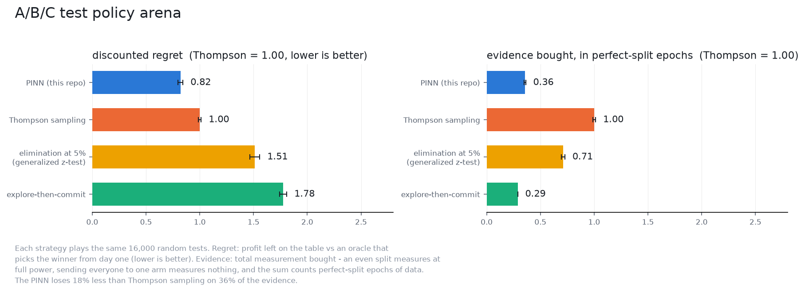

# PINN for optimal decisions in your business



*Every line is one A/B/C test, drifting as evidence arrives; its dot is the decision, the arm the test shipped. The colored field underneath is the trained network's policy, and the boundaries where the lines stop are where it judges that more evidence is no longer worth its price.*

If you love money, you will love this repo! It's all about money and decision-making, things that Very-Important HiGh StAkEs people do. Naah! Just kidding. This is just for computers to take those decisions for you. For example, the age-old question: AB-testing. The blue button or the red button? In this repo, I tackle AB, ABC and more decision processes using the final-boss of all decision methodologies: [the HJB equation](https://en.wikipedia.org/wiki/Hamilton%E2%80%93Jacobi%E2%80%93Bellman_equation). If you are spooked by horrible equations, don't click!

Since you might be a very busy person, here is the gist of it: I did the complex part so that you may have fun with a real piece of engineering. To _use_ the code in this repo, it's quite easy: you just need the trained model and off you go (see usage below). Yes, it's a Neural Net trained for _your_ problem. No, I didn't invade your company's server and steal your datasets. The neural networks here work as _controllers_ to solve a complicated, but well-known problem, such as AB testing. Just plug-and-play and let the neurons do the rest.

## But is it any good?

Yes, it even beats Thompson Sampling for a simple AB test. Oh! If you have been doing Z-test with p-value=5%, I have bad news for you. It might be a great way to do a Phase III trial, but not for [running decisions all the time](https://en.wikipedia.org/wiki/Data_dredging#Optional_stopping). Anyway, here is the roster:



| policy | regret (Thompson = 1.00) | wrong commits | commits | evidence (Thompson = 1.00) |
|---|---|---|---|---|
| PINN (this repo) | **0.80** | 6.6% | 99.2% | **0.46** |
| Thompson sampling | 1.00 | 0.0% | never | 1.00 |
| explore-then-commit | 1.65 | 13.0% | 100% | 0.33 |
| z-test at 5% | 1.81 | 10.7% | 93.7% | 0.67 |

Slightly better than TS in terms of "gains left on the table" (regret) and with the added benefit that _it actually stops_. It also needs to explore less in total. TS, even though it can deliver the goods, is known to be quite the over-curious explorer and the neural network fixes that. Full tables, including the three-arm arena, live in [kb/arena_results.md](kb/arena_results.md).

## Beyond just AB

### We can do ABC as well. Look at the policy atlas for it:



This "Gaussian blur"-thingy vanishing with information shows the net being more confident the more information you pass to it. And its performance is even better than for the AB test:



| policy | regret (Thompson = 1.00) | wrong commits | commits | evidence (Thompson = 1.00) |
|---|---|---|---|---|
| PINN (this repo) | **0.77** | 10.4% | 99.8% | **0.38** |
| Thompson sampling | 1.00 | 0.0% | never | 1.00 |
| elimination at 5% (generalized z-test) | 1.53 | 11.8% | 90.5% | 0.71 |
| explore-then-commit | 1.81 | 20.9% | 100% | 0.29 |

What about ABCD? Man, the equations are *gnarly* for ABC already and should just be impossible for ABCD, but if you want to build it, you are welcome to contribute with a PR. There is already some support and some tips about how to do it in
[kb/learnings.md](kb/learnings.md). However, be warned that PINNs do not scale to even hundreds of input dimensions and the number of features you have to feed the network is quadratic.

### More coming in the future

There are other related problems I plan to tackle in the future. They are still stochastic models, but stray away from bandit problems. Star this repo and stay tuned!

## What's inside

A quick map of the repo, for the curious:

- `pinn/problems/two_arm` and `pinn/problems/three_arm`: the trainable models,
  samplers, and PDE losses (dimensionless, wedge-quotiented by the problems'
  exact symmetries). The math lives in `kb/two_arm.md` and
  `kb/three_arm.md`; the transferable methIt'sod in `kb/learnings.md`.
- `pinn/problems/two_arm_drift` and `pinn/problems/three_arm_drift`: the same
  two problems in a world where the effects themselves drift, so yesterday's
  evidence decays and a committed decision can become wrong on its own. One
  extra parameter, no extra state: the drift rate is a network input, so a
  single checkpoint serves every drift regime, and it reduces to the static
  problem exactly when the drift is zero. Maths in `kb/two_arm_drift.md` and
  `kb/three_arm_drift.md`.
- `pinn/arena`: the policy shoot-out. An N-arm regret harness, the baseline
  zoo (Thompson, explore-then-commit, z-test/elimination), and the PINN
  entrant. Run it with `poetry run arena simulate ...` and then
  `poetry run arena analyze ...`.
- `pinn/cli`: the `pinn` command, one module per subcommand — `init` to
  create an untrained checkpoint, `train` to train it, `plot` and `validate`
  for two-arm diagnostics.
- `jobq`: rent a GPU, train on it, get the results back. `jobq up` creates a
  RunPod pod and pushes the repo, `jobq run` executes there with the output
  streaming to your terminal, `jobq backup` mirrors results down as they are
  written, `jobq down` fetches everything and destroys the pod. Entirely
  optional — nothing in the repo needs it.

Trained models are published on the
[latest release](https://github.com/tokahuke/pinn/releases/latest). The
release predates the current naming convention, so rename as you download —
every command and snippet here looks for these two paths:

| release asset | save as |
|---|---|
| `value_2a_32x512.pt` | `data/two_arm.pt` |
| `value_3a_64x64x64.pt` | `data/three_arm.pt` |

The other assets are archival: the drifting-world nets (`value_2ad_`,
`value_3ad_`), a legacy two-arm architecture, and a 16-kink three-arm
experiment that lost to the 8-kink one. Everything else in this repo exists
to train, test, and beat those two files.

## Quickstart

```sh
poetry install

# Create a net, then train it.
poetry run pinn init --problem three_arm --topology 64:64:64k8 \
    --out data/three_arm.pt
# Trains in place: --out defaults to --in. Ctrl-C stops and saves.
poetry run pinn train --problem three_arm --in data/three_arm.pt --lr 1e-3

poetry run python probes.py --in data/three_arm.pt   # diagnostics
poetry run arena simulate data/study.pkl --problem three_arm \
    --rho 0.999 --horizon 500 --sigma 1 --effect 0 --effect-std 0.3 --size 1000
poetry run arena analyze data/study.pkl
```

To use a trained two-arm model in your own code, load it from disk, tell it
your economics, and ask for the split:

```python
import torch
from pinn.problems.two_arm import DimensionlessValueFunction, ValueFunction

# Your experiment's economics: sigma is the noise scale of one observation,
# rho the discount rate per observation (how impatient you are).
value = ValueFunction(
    DimensionlessValueFunction.load("data/two_arm.pt"),
    rho=0.001,
    sigma=50.0,
)

# Current posterior: treatment leads by mu = 1.0 with precision tau = 0.1
# (standard deviation ~3.2). The policy returns the share of traffic to
# send to treatment right now.
value.policy(torch.tensor([1.0]), torch.tensor([0.1]))   # 0.69: lean in, keep testing
value.policy(torch.tensor([3.0]), torch.tensor([0.25]))  # 1.00: commit, stop testing
```

An answer of exactly 1.0 or 0.0 is the model saying the test is over: further
evidence is no longer worth its discounted cost. Three arms work the same way
through `pinn.problems.three_arm` with the pair of challenger means and the
2x2 precision matrix.

## License

Copyright 2026 Pedro Arruda.

Licensed under the Apache License, Version 2.0 (the "License"); you may not
use the contents of this repository except in compliance with the License.
You may obtain a copy of the License at
http://www.apache.org/licenses/LICENSE-2.0 (also included in
[LICENSE](LICENSE)).

Unless required by applicable law or agreed to in writing, the software and
the trained model checkpoints published as release assets are distributed on
an "AS IS" BASIS, WITHOUT WARRANTIES OR CONDITIONS OF ANY KIND, either
express or implied, including without limitation any warranty of
merchantability, fitness for a particular purpose, or non-infringement. In
no event shall the authors or copyright holders be liable for any claim,
damages, or other liability arising from the use of this software or the
published model checkpoints, including decisions made or actions taken by
systems that incorporate them. See the License for the specific language
governing permissions and limitations.

The models implement statistical decision-making under uncertainty; their
outputs are not guaranteed to be correct, optimal, or fit for any particular
application. Users are solely responsible for validating suitability before
deployment.
