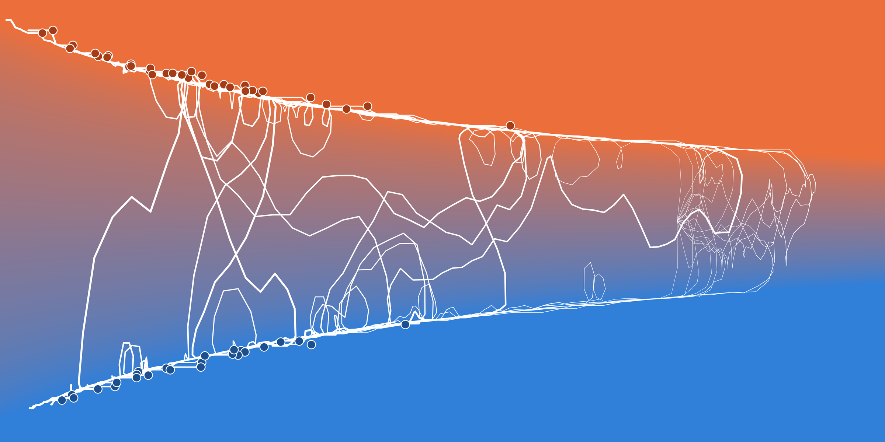

# When the ground moves: allocation under drift

*Eighteen tests in a world that will not sit still. Horizontal is accumulated
precision, vertical is the current belief about the effect, and the field is the
trained policy: orange where it puts everything on treatment, blue where it puts
everything on control, and the pale corridor between them where it still splits
the traffic. Each dot is where a sustained commitment began.*

You know how a test ends. You split the traffic, you watch the two arms pull
apart, and at some point the evidence is good enough that you ship the winner,
take the test down and go do something else. The ending is the whole point of
running the thing, and everything before it is just the bill you pay to get one.

That story rests on an assumption that has nothing to do with statistics: the
winner _stays_ the winner. The effect is a fixed number sitting out there in the
world, you are paying to find out what it is, and once you know it, you know it.

Now let the effect wander. Formally, `d theta = eta dW`: the true effect
diffuses on its own at volatility `eta`, independently of the noise in your
observations. Nothing about the measurement changes, since the arm still pays
`theta` per unit of traffic, the observations are still noisy at the same scale,
and the posterior mean is still a martingale. What changes is the shelf life of
everything you have already learned.

## Knowledge has a leak

In the static problem, precision (`tau`, one over your posterior variance) only
ever goes up:

    dtau/dt = alpha(1-alpha)/sigma^2

with `alpha` the share of traffic on treatment. You buy precision by splitting,
at a rate that dies at both ends, since a test running all its traffic through
one arm learns nothing about the contrast between them.

Under drift, that same clock gains a second term:

    dtau/dt = alpha(1-alpha)/sigma^2 - eta^2 tau^2

The first term is what you buy. The second is what the world takes back while
you are not looking, and it never asks what you are doing: it runs at
`eta^2 tau^2` whether you are testing, committed or on holiday. Ship the winner,
walk away, come back later, and you know less than when you left, having spent
nothing and learned nothing in the meantime. Doing nothing has become a way of
_losing_ information, which is an odd thing to have to say about doing nothing.
(The derivation, filter identity included, is in
[kb/two_arm_drift.md](../kb/two_arm_drift.md).)

## There is a ceiling on what you can know

Read the two terms as a race. The purchase term has a hard cap: `alpha(1-alpha)`
peaks at the even split, where it is 1/4, so precision comes in at a bounded rate
however aggressively you test. The leak has no cap, growing like `tau^2`. They
cross, and the crossing is at

    tauhat* = 1/(2 etahat)

Hats mean the quantity has been rescaled by the discount rate `rho` and the noise
scale `sigma` until no units are left, so `tauhat` is precision in the problem's
own units and `etahat = eta/(rho sigma)` is the drift in them. Above the ceiling,
precision drains _whatever_ you play, and below it learning wins. And the ceiling
is an attractor of the precision flow, approached from both sides: overshoot it
and you fall back, sit under it and testing carries you up. There is a
best-informed state your experiment can reach, and it is not "eventually,
certainty".

## Committing stopped being an ending

Put all the traffic on one arm. Then `alpha(1-alpha) = 0`, the purchase term is
gone, and

    dtau/dt = -eta^2 tau^2 < 0

Committing is no longer absorbing. Precision decays from the moment you stop
testing, uncertainty regrows, and the option to change your mind keeps its value.

You might reasonably answer that you would simply re-test when your belief
moves. But while you are committed your belief cannot move! Every visitor goes
to the leader, so nothing you observe says anything about the contrast between
the arms, and your belief sits exactly where you left it while the effect
underneath it wanders off and your precision rots.

That kills a whole piece of the static problem. In the static two-arm problem
([kb/two_arm.md](../kb/two_arm.md)) the exploration premium `u`, the value of
being able to change your mind, is exactly zero past the commit boundary
`muhat = G(tauhat)`: the premium pastes onto zero there (value matching) and it
pastes flat (smooth pasting), and that flatness is what pins the boundary down.
And that really is the end of the story, because the state crosses, the premium
dies and there is nothing left on the other side to compute. Under drift, the
set where the premium is zero is empty. `u > 0` strictly everywhere, because an
option to change your mind cannot be worthless while your certainty leaks.

So the boundary is still there. Drift took the ending away and left the boundary
standing, and you can see it in the picture as the place where the field goes
solid. Crossing it costs nothing in value and nothing in slope, and what jumps
as you cross is the curvature. Nobody draws that line on the chart by hand,
either: the trained net has to work out for itself where it goes.

## Now look at the picture again

The chart is the funnel of doubt, the same (precision, belief) chart the static
hero image uses ([hero2.png](./hero2.png)), with the drifting policy painted
underneath. One thing to unlearn when reading it: in the static funnel,
horizontal position is time, because precision only grows. Here it is nothing of
the sort, since a path moves right while it learns and left while it forgets, so
the clock is carried by the weight of the trails instead. Each trail starts as a
hairline and thickens as its simulation runs. The paths are born together near
the ceiling, over on the right, and the sprawl to the left happens later. (The
picture is drawn at `etahat = 0.7`, which puts the ceiling at `tauhat* = 0.71`
and the birth precision just under it at `tauhat = 0.55`.)

A dot marks the start of a sustained committed episode, and "sustained" is doing
work in that sentence: the boundary chatters by epsilon while a path rides it,
so episodes shorter than a debounce window are counted as chatter and not drawn.
And no dot ends _anything_: the trails run until the simulation clock runs out,
wherever they happen to be at the time.

Follow one line along a wall and the cycle comes apart into four beats:

1. The path is committed. Every visitor goes to the leader, so no observation
   says anything about the contrast, the belief freezes, and precision erodes.
   On the chart the path slides left along a horizontal line.
2. The corridor is wider at low precision, so sliding left eventually carries
   the frozen belief back under the boundary and into the corridor.
3. The policy buys a pinch of contrast information, enough to re-confirm the
   leader and no more. That is the small excursion hanging off the wall into the
   corridor.
4. The leader is re-confirmed, the policy goes all-in again, and beat 1 starts
   over.

Run that long enough and it stops reading as a sequence of decisions and starts
reading as a ride. The state surfs the commit boundary, paying the smallest
information bill that keeps it on the committed side, and the scallops along the
top and the bottom of the picture are that equilibrium drawn one wobble at a
time. The shape is familiar from singular-control problems, which do the same at
their no-action boundaries, where nothing happens until the state touches the
boundary and the control then pushes just hard enough to keep it there.

One caveat about the trails: the finest step-to-step flicker in them is my
integrator rather than the policy, since the simulation takes fixed steps and
jitters around the equilibrium. The multi-step excursions and re-entries are the
mechanism.

## Turn the dial to zero

None of this is a separate model. `etahat` goes into the network as one more
input feature, `log1p(2 etahat tauhat)`, the ratio of your precision to the
ceiling, which is exactly 0 when `etahat = 0`; and the envelope the premium is
built against collapses onto the static one bitwise there, by `torch.equal`
rather than by tolerance. One trained checkpoint therefore covers every drift
regime, and the world you started in, where the funnel narrows forever and every
test ends exactly once, is the `etahat = 0` slice of it.
