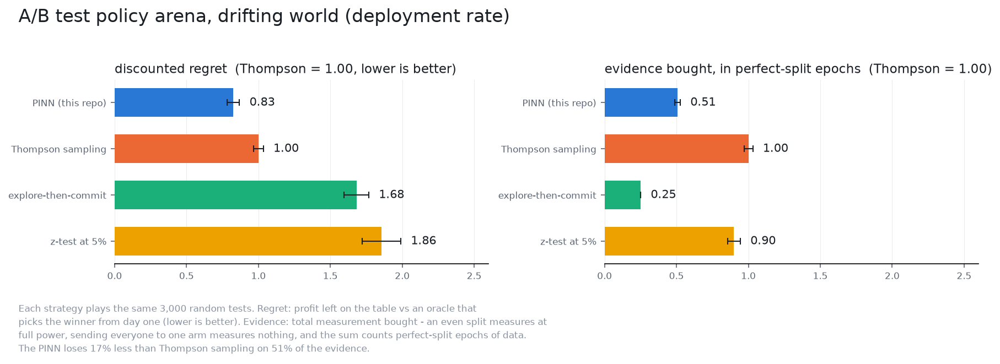
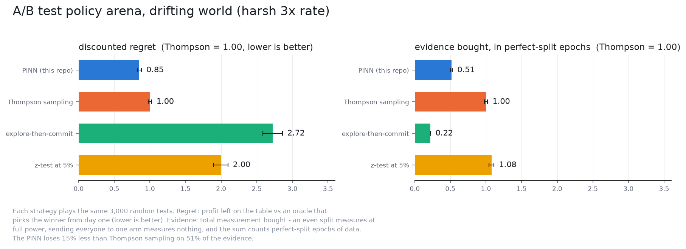

# The drifting world: arena results

Same harness as the static arenas, with the true effect itself diffusing.
Both worlds use the production parameters; they differ only in the drift
rate eta.
3,000 paired reps per policy: every entrant plays the same drawn
effects and the same noise.

## Deployment rate (eta = 1.3545)

| policy | regret (Thompson = 1.00) | wrong commits | commits | evidence (Thompson = 1.00) |
|---|---|---|---|---|
| PINN (this repo) | **0.83** | 10.8% | 100% | **0.51** |
| Thompson sampling | 1.00 | 0.0% | never | 1.00 |
| z-test at 5% | 1.86 | 14.0% | 96% | 0.90 |
| explore-then-commit | 1.68 | 14.0% | 100% | 0.25 |

## Harsh rate, 3x (eta = 4.0635)

The winner flips roughly once per horizon.

| policy | regret (Thompson = 1.00) | wrong commits | commits | evidence (Thompson = 1.00) |
|---|---|---|---|---|
| PINN (this repo) | **0.85** | 16.1% | 100% | **0.51** |
| Thompson sampling | 1.00 | 0.0% | never | 1.00 |
| z-test at 5% | 2.00 | 19.8% | 100% | 1.08 |
| explore-then-commit | 2.72 | 16.5% | 100% | 0.22 |

## The `_FLATTEST_TAUHAT` guard

The arena clamps the net's precision input from below. It was 1e-2 until
2026-08-13, guarding a low-precision corner the champion of that date no
longer has. Loosening it to 1e-3 (the sampler's own floor) changes only the
PINN; every other entrant is byte-identical, which is what makes this a
controlled comparison.

| world | guard 1e-2 | guard 1e-3 | paired difference |
|---|---|---|---|
| deployment | 14,343 | 14,704 | -361 +/- 601 |
| harsh 3x | 62,414 | 23,661 | +38,753 +/- 3,591 |

In the harsh world the guard cost 62% of the PINN's regret; in the
deployment world it made no measurable difference. At 1e-2 the PINN lost to
Thompson under harsh drift (62,414 against 27,771); at 1e-3 it wins,
23,661 against 27,771, a paired 4,110 +/- 778.
